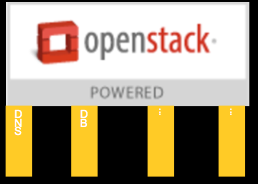

=======================================
Extension Programs - Current Direction
=======================================

.. contents::

Status
======
**This document is a working draft and should not be considered final.**

Introduction
============

This document contains information about new interoperability
programs currently under consideration by the Interop Working Group.
The purpose of this document is to provide the community with information
about our current direction in the development of these programs as a means
in order to foster conversation and useful feedback.

In this document we describe two new categories of programs under
development: "vertical" programs and "add-on" programs.  We will also
discuss the current "OpenStack Powered" program as a means of comparison.
It is important to note that of these, only the "OpenStack Powered" program is
currently an established program approved by the OpenStack Foundation
and in use today.  The "add-ons" and "verticals" programs have not yet
been finalized and are still in development (though early discussion has
been carried out in several public forums to date, including Interop WG
meetings, Board of Directors meetings, the PTG, etc).

Premise
=======

OpenStack is tremendously flexible, feature-rich, powerful software that can
be used to create clouds that fit a wide variety of use cases including
software development, web services and e-commerce, network functions
virtualization (NFV), video processing, and content delivery to name a few.
Commercial offerings built on OpenStack are available as public clouds,
installable software distributions, managed private clouds, appliances,
and services. OpenStack can be deployed on thousands of combinations of
underpinning storage, network, and compute hardware and software. Because
of the incredible amount of flexibility OpenStack offers and the constraints
of the many use cases it can address, interoperability between OpenStack
clouds isn't always assured: due to various choices deployers make,
different clouds may have some inconsistent behaviors.

The OpenStack community began to address issues surrounding the balance
of interoperability and flexibility with the creation of the DefCore
Committee in 2013, and the subsequent creation of the first
Interoperability Guidelines in 2015.

As OpenStack's adoption has become more widespread, it's roster of
projects has expanded, and it's traction in particular use cases has
increased, the community has begun to consider additional programs to
meet the evolving needs of the OpenStack ecosystem, including end users,
administrators, vendors, and community participants.

The OpenStack Powered (TM) Program
==================================

The `OpenStack Powered <https://www.openstack.org/brand/openstack-powered/>`_
program is the current program used by the OpenStack Foundation to provide
vendors who create products that are built on OpenStack Software with a
means of demonstrating interoperability and acquiring a trademark license.
Under this program, vendors who create products built on OpenStack (including
public clouds, distributions and appliances, hosted private clouds, and
remotely managed private clouds) can apply for a license to use one of
three
`OpenStack Powered(TM) logos <https://www.openstack.org/brand/interop/>`_.
In order to be eligible to obtain a license to use the OpenStack name and
an OpenStack Powered logo, the vendor must validate that their products
adhere to certain requirements.  The complete list of requirements can be
`found online <https://www.openstack.org/brand/interop/>`_, but for the
sake of comparison with other programs in development we'll summarize
lightly here.  The chief requirement is that the product must adhere to
one of the two most recent Interoperability Guidelines approved by the
OpenStack Foundation Board of Directors.  Some pertinent details include:

1. Interoperability Guidelines are created by the
   `Interop Working Group <https://wiki.openstack.org/wiki/Governance/InteropWG>`_
   approximately every six months and must be approved by a vote of the
   Board of Directors.

2. Interoperability Guidelines contain a list of "Capabilities" that the
   product must expose to end users.  Capabilities can generally be thought
   of as things a user can expect to be able to do with the cloud, such as
   creating servers, deleting storage volumes, or listing networks he or
   she owns.

3. Interoperability Guidelines contain a list of tests for each Capability.
   Vendors must pass all required tests to adhere to the Guideline.
   According to the current Board-approved Interop WG
   `governance process <./2016A.rst>`_, the tests used in Guidelines are
   required to be under OpenStack Technical Committee governance and have
   unique identifiers that are durable across releases and changes in
   grouping (e.g. an idempotent ID that does not change if, for example,
   Tempest moves the test from one place or class to another within it's
   development tree).

   At this point, it is important to note that the Interop WG selects
   capabilities and their corresponding tests using a set of twelve
   Board-approved, weighted `Core Criteria <./CoreCriteria.rst>`_.  One of
   those Criteria is "Future Direction" which is defined as "Should
   reflect future technical direction (from the project technical teams
   and the TC) and help manage deprecated capabilities."  In May of 2016
   the TC passed a
   `resolution <https://governance.openstack.org/tc/resolutions/20160504-defcore-test-location.html>`_
   stating that the Interop WG (formerly known as the DefCore Committee)
   "consider it an indication of future technical direction that we do
   not want tests outside of the Tempest repository used for trademark
   enforcement, and that any new or existing tests that cover capabilities
   they want to consider for trademark enforcement should be placed in
   Tempest."  Based on this resolution, some projects began considering
   migrating tests currently hosted in their project repositories to
   the Tempest repository.

   Other notable information about desirable tests for use in
   Interoperability Guidelines can be found in a
   `specification <../../working_materials/interop_test_spec.rst>`_
   created by the Interop Working Group in 2016.

4. Interoperability Guidelines contain a list of
   `Designated Sections <../DesignatedSections.rst>`_ of community-developed
   source code that must be used to provide the required Capabilities.
   Designated sections are used to ensure that products calling themselves
   "OpenStack" are actually using OpenStack code rather than a substitute
   implementation of the same API that is not developed by the OpenStack
   community.

In order to validate that a product adheres to a Guideline, the vendor
must submit results of the tests listed in a Guideline.  Typically, this
is done via the `RefStack <https://refstack.openstack.org/#/>`_ tool,
which is an OpenStack project independent of the Interop Working Group
but closely involved.  Prior to the passage of the
`TC resolution on location of tests <https://governance.openstack.org/tc/resolutions/20160504-defcore-test-location.html>`_
the RefStack project had already implemented the means to accept results
of tests that do not reside in the Tempest project tree, but use the
`Tempest plugin interface <https://docs.openstack.org/developer/tempest/plugin.html>`_.  This detail becomes somewhat important to note before we discuss
programs currently under development below.

"Vertical" Programs
===================

As OpenStack has matured, it has found traction in a variety of use cases.
Some of these use cases have requirements that may differ somewhat from
those of other use cases.  They may require additional capabilities to be
offered by a cloud, some of which may be less frequently used or even
offered by more general-purpose clouds.  Some such capabilities might
not meet the `Criteria <../CoreCriteria.rst>`_ for inclusion in the
OpenStack Powered programs now or in the foreseeable future due to their
focus on core, broadly applicable capabilities rather than those more
narrowly focused on particular use cases.  While these more "vertical"
use cases have some differing requirements, they are not completely
different than other OpenStack clouds: very often they deploy many of
the same projects, use many of the same capabilities, and have development
governed and supported by the same bodies (such as the Technical Committee
and Board of Directors).  Within the constraints of the use case being
addressed, there is also an interest in interoperable implementations.

To illustrate, we might use the example of Network Functions
Virtualization (NFV).  If a provider wishes to use OpenStack as part of
an NFV offering, the provider might need some capabilities from OpenStack
that are currently not required under the OpenStack Powered (TM) program.
These might include capabilities like SR-IOV support, NUMA-aware scheduling,
projects like Heat or Tacker, or specific administrative API's that must be
exposed to the provider.  A provider building an NFV offering may wish to
have some assurance of interoperability when selecting which OpenStack
products to use--but the OpenStack Powered(TM) program may be too general
to be very useful.

In order to foster development of these "vertical" use cases, the community
is considering whether and how to build interoperability programs that
can be better aligned with these specific use cases.  The exact wording,
mechanics, target use cases, and logo design associated with such programs
is still in the very early stages of discussion, but conceptually they
might be thought of along these lines:

Our current inclination for these programs is to re-use as much of the
process, tooling, and framework established in the creation of the
OpenStack Powered (TM) program as is practical.  The following points
indicate our current thinking on these programs:

1. New Guidelines would be drawn up for vertical programs using the same
   JSON schema as the existing Interoperability Guidelines.

   a. We note that some modification to the schema would be needed to
   accommodate these programs (and work is already
   `underway to adjust the schema <https://review.openstack.org/#/c/430556/>`_
   ), but the desired end-state is to have a common format for both.

   b. Using a common schema would also better enable us to use the existing
   RefStack tools to collect and present testing data.  Again, some
   adjustments may be necessary, but the desire is to avoid creating
   an entirely separate set of tools.

2. When possible, Criteria for these programs will largely be the same as
   for the existing OpenStack Powered program, but applied to a narrower
   audience that has an interest in the specific use case.

   a. For example, one Criteria used in the OpenStack Powered program is
   "widely deployed".  If we were to create a vertical program for
   NFV, the criteria might be read as "widely deployed among OpenStack
   products used for NFV".  Thus, a project or capability that doesn't
   qualify as "widely deployed" for a general audience might qualify
   if it is widely used among NFV deployments.

3. When possible, embrace adjacent communities in the design of vertical
   programs.

   a. For example: we might work with the OPNFV community in the design
   of a program targeted at NFV use cases, or with the Kubernetes
   or Cloud Foundry communities in the design of a program oriented
   at container or PaaS use cases.

   b. Adjacent communities may be able to help us with determining the
   merits of various capabilities, design of Criteria, or may even
   have tests we can take advantage of.

   c. It is also goes without saying that relevant groups within the
   OpenStack community are welcome to provide input too.  For example,
   the Operators Telcom and NFV Working Group might have useful input
   to provide on the creation of a vertical program targeted an NFV
   use cases.

4. Some changes to restrictions on tests may be necessary depending on the
   use case.

   a. For example: some use cases might be dependent on administrative
   capabilities or API's, as OpenStack may be an underpinning component
   of an offering rather than directly exposed to end users.  In such
   cases, we might discard the requirement that tests not use
   administrator credentials.

   b. Acceptable locations for tests used by such programs may also be
   reconsidered.  It is important to note that vertical programs did
   not exist and were not considered by the Technical Committee when it
   created it's
   `resolution <https://governance.openstack.org/tc/resolutions/20160504-defcore-test-location.html>`_ in 2016.  Some vertical programs may use
   projects that are less widely deployed generally, and migrating
   their tests into Tempest may create an undue burden for multiple
   parties (including the project team and QA team).  Since RefStack
   already has the ability to use tests using the Tempest plugin
   interface, the technical barrier is relatively small for RefStack
   to be able to consume them in many cases:
   it's more a question of how best to govern the tests.

5. Guidelines for vertical programs would still need to be approved by
   the Board of Directors and would likely take a similar cadence to the
   OpenStack Powered program.

   a. Ultimately, any use of the OpenStack trademarks and any new
   trademarks and logos are the property of the OpenStack Foundation.
   It's Board of Directors is the final authority on licensing of
   those assets.

6. Whenever possible, vertical programs should build on the existing
   OpenStack Powered program--or should at least not contain conflicting
   requirements.

   a. It is likely that the Capabilities required in the OpenStack Powered
   program are a subset of the capabilities needed for a specific use
   case or vertical.

   b. Some Capabilities required by the OpenStack Powered program may not
   be useful for particular vertical programs, but also likely don't
   conflict with the Capabilities a vertical program would rely on.

   c. In the very worst case, a Capability required of a vertical program
   might directly conflict with a Capability required of the OpenStack
   Powered program.  We expect such cases to be very rare and these
   would likely cause us to re-evaluate whether the two Capabilities
   in question actually meet the Criteria for the requisite programs.

"Add-On" Programs
=================

The OpenStack community has created a large number of software projects
over the years of its development.  Many are broadly adopted (such as
Nova and Keystone, which showed 98% adoption among production deployments
in the
`April 2017 User Survey <https://www.openstack.org/assets/survey/April2017SurveyReport.pdf>`_).
Others are less widely adopted, but are still seen as very important to
those users who do choose to deploy them.  Deployers of these projects
would like to have some assurances about interoperable implementations, just
as users of the more widely adopted set receive via the OpenStack Powered
program today.

However, there are some challenges to including these projects in the
OpenStack Powered program since it is targeted at widely used, "core"
projects.  Some of these include:

1. Lower product adoption.  If only a small number of consumers demand
   a project, vendors may choose not to include it in their products, as
   doing so incurs some cost for them.  Adding lots of these projects to
   the OpenStack Powered program takes away it's focus on "core" and
   would likely cause many products to simply leave the program rather
   than incur the extra cost of including them.

2. Test requirements.  By a similar measure, many projects today do
   not place their tests in the Tempest tree, or only put some of their
   tests in Tempest.  Many instead house the tests in the project tree
   (often but not always using the Tempest plugin interface).  Moving
   test for all projects into Tempest would create a heavy burden on the
   QA team and on the projects.  The benefits of doing so may also
   not be as great as they for the OpenStack Powered program.  In the
   case of the OpenStack Powered program, one perceived benefit of
   centralizing the tests in one place was to have them more consistently
   reviewed.  For example, the QA team would presumably be familiar
   with the Guidelines and make sure that if changes substantial enough
   to call interoperability into question were made to a test, those
   changes would be discussed appropriately in the context of the
   OpenStack Powered program.  Within the bounds of a program targeting
   an individual project, there may be somewhat less need for review by
   a cross-project team, particularly if the individual project team
   is aware of the same Criteria, tooling, and general principals
   (as they presumably would be if they are drafting a Guideline
   themselves rather than the Interop Working Group doing so).

3. Changing Criteria.  The Criteria for the existing OpenStack Powered
   program were created with the "core" of OpenStack in mind, and the
   OpenStack Powered mark was intended to convey support for "core" level
   of interoperability.  Adding a potentially large number of projects
   that are not as widely adopted to this mark would substantially alter
   it's meaning, and would create some confusion in the market.

4. Increased workload on the Interop Working Group.  Careful consideration
   of capabilities for the projects already in the OpenStack Powered
   program is already a very demanding task.  Going through the same
   process for a potentially much larger list of projects would create
   a bottleneck.

With that said, the OpenStack community would still like to address the
desire for interoperable implementations for those who do choose to deploy
projects that are not included in the OpenStack Powered program today.
Further, the Interop Working Group would like to see such projects take a
more direct role in defining what "interoperable" means for their projects
(which would also help distribute the work of evaluation).  When project
teams are actively thinking about interoperability, everyone wins.

In this light, we are considering creating "add-on" programs for the
OpenStack Powered program that would allow products that provide additional
software outside of that required for the OpenStack Powered mark to
demonstrate that they provide interoperable implementations.  For example,
products that provide DNS-as-a-Service might be able to advertise themselves
conceptually as "an OpenStack Powered Platform Plus DNS".  The exact
wording, mechanics, and logo design associated with such programs is still
in the very early stages of discussion, but conceptually it can be thought
of like so:

The following points indicate our current thinking on these programs:

1. New Guidelines would be drawn up for add-on programs using the same
   JSON schema as the existing Interoperability Guidelines.

   a. As with vertical programs, the intent is to be able to re-use
   as much tooling and formatting as possible.

2. Where possible, Criteria for these programs will largely be the same as
   for the existing OpenStack Powered program, but applied to a narrower
   audience that has an interest in the relevant project.

   a. For example, one Criteria used in the OpenStack Powered program is
   "widely deployed".  If we were to create an add-on program for
   Designate (which was deployed in only 8% of production clouds
   in the `April 2017 User Survey <https://www.openstack.org/assets/survey/April2017SurveyReport.pdf>`_),
   the criteria might be read as "widely deployed among products that
   include Trove".  Creating a recordset with the v2 API might be
   a capability that most Trove deployments provide, even if that
   is a small subnet of overall OpenStack implementations provide.

3. Project teams should be directly responsible for the selection of
   capabilities, tests, and designated sections for their add-on programs.

   a. The Interop Working Group (with the approval of the Board of
   Directors) will remain responsible for Criteria, schemas, general
   process, cadences, and other aspects of these programs that should
   be common across all projects.

   b. The individual projects themselves will select the Capabilities they
   consider to meet the Criteria set out by the Interop Working Group,
   the tests they wish to use to provide proof that a product supports
   those capabilities, and the designated sections of code used to
   provide those capabilities.

   c. Guidelines created by the projects must be approved by the Interop
   Working Group and ultimately by the Board of Directors.  This provision
   also helps alleviate some concerns around review consistency.  The
   individual project teams make the intial selection based on Criteria
   from the Interop Working Group, and the Interop Working Group then
   serves as a check once that process is complete.

4. Some changes to the restrictions on tests may be necessary.

   a. As noted above, moving all tests into the Tempest tree likely
   creates undue burden without substantial benefit.

   b. In some cases, the capabilities a project wishes to use to express
   interoperability may be somewhat different in nature than those
   used in the OpenStack Powered program.  For example: tests for
   Heat might focus on support for specific resources in Heat templates
   rather than simply the API.
